# Awesome Data Privacy Management 🛡️

  
  
  
  
  
  

## 📌 Top Data Privacy Management Platforms Ecosystem

**Curated List of Enterprise SaaS Products & Open-Source GitHub Projects**

*Focused on Privacy Operations, DSAR Automation, Consent & Preference Management, Data Discovery, PII Detection, and Regulatory Compliance (GDPR, CCPA/CPRA, HIPAA, LGPD).*

---

### 🌐 Overview

This repository tracks leading **SaaS platforms** and **open-source projects** for **Data Privacy Management**. Modern privacy engineering systems enable organizations to index personal data, fulfill Data Subject Access Requests (DSARs), automate consent preferences, execute Privacy Impact Assessments (PIA/DPIA), and maintain continuous regulatory compliance.

Whether you are a Data Protection Officer (DPO), privacy engineer, compliance lead, or developer, this list highlights both commercial enterprise suites and open-source building blocks.

---

## 📑 Table of Contents

- [🏢 SaaS / Hosted Platforms](#-saashosted-platforms)
- [💻 Open-Source GitHub Projects](#-open-source-github-projects)
- [⚙️ Architecture & Self-Hosted Patterns](#-architecture--self-hosted-patterns)
- [🤝 How to Contribute](#-how-to-contribute)
- [📈 Star History](#-star-history)
- [💖 Support & Community](#-support--community)
- [⚠️ Disclaimer](#%EF%B8%8F-disclaimer)

---

## 🏢 SaaS / Hosted Platforms

> 📊 **Market Size & Structure:** The global Data Privacy Management software market is estimated at **$2.7 Billion (2024)** and is projected to expand to **$15.2 Billion by 2030** at a CAGR of **33.4%**. The market is **moderately fragmented**, featuring dominant enterprise leaders (*OneTrust, BigID, Securiti*) alongside specialized fast-growing niche providers for developer-first DSAR automation, consent management, and code-level privacy scanning.

Below is a comparison of top enterprise Data Privacy Management SaaS platforms, sorted by **Company Valuation / Size (descending)**:

| Platform | Core Capabilities | Starting Price | Free Tier / Trial Limits | Company Valuation / Size |
| :--- | :--- | :--- | :--- | :--- |
| **[OneTrust](https://www.onetrust.com/)** 🏢 | Broad privacy management suite covering consent, DSAR, assessment automation, RoPA, preference management, and AI governance. | `$1,500/year` ($125/mo per module) | **14-day free trial** *(Access to Cookie Consent & Assessment modules)* | **$5.3B Valuation** ($1B+ Raised, 2,000+ employees) |
| **[BigID](https://bigid.com/)** 🔍 | ML-driven data discovery, classification, rights fulfillment, and sensitive PII risk remediation across enterprise data. | `$12,000/year` ($1,000/mo enterprise base) | **30-day free trial** *(Cloud sandbox with up to 5 data sources)* | **$1.0B+ Valuation** ($320M+ Raised, 500+ employees) |
| **[Securiti](https://securiti.ai/)** 🛡️ | Data command center integrating sensitive PII discovery, automated rights requests, and AI governance controls. | `$2,500/year` ($208/mo base plan) | **14-day free trial** *(Full Data Command Center, 10 scan runs)* | **$1.0B+ Valuation** ($250M+ Raised, 450+ employees) |
| **[TrustArc](https://trustarc.com/)** 📋 | Enterprise privacy platform for privacy assessments, risk management, consent compliance, and RoPA workflows. | `$3,600/year` ($300/mo starter tier) | **14-day free trial** *(Assessment builder & privacy program manager)* | **$300M+ Valuation** ($100M+ Raised, 350+ employees) |
| **[Transcend](https://transcend.io/)** ⚡ | Developer-first privacy infrastructure for fully automated multi-system DSAR orchestration and web consent controls. | `$990/month` ($11,880/year starter tier) | **30-day free trial** *(Automated DSAR requests up to 100 requests)* | **$300M+ Valuation** ($90M+ Raised, 150+ employees) |
| **[DataGrail](https://www.datagrail.io/)** 🔄 | Automated privacy operations specializing in live data mapping, DSAR request fulfillment, and vendor risk tracking. | `$6,000/year` ($500/mo starter tier) | **14-day free trial** *(Includes data mapping & 25 DSAR test requests)* | **$200M+ Valuation** ($84M+ Raised, 150+ employees) |
| **[Osano](https://www.osano.com/)** 🌐 | All-in-one CMP, DSAR request manager, and vendor risk management platform for growing organizations. | `$199/month` ($2,388/year Business tier) | **Free Forever** *(1 domain, up to 5,000 monthly pageviews)* | **$150M+ Valuation** ($44M+ Raised, 100+ employees) |
| **[Didomi](https://www.didomi.io/)** 🍪 | Cross-platform consent and preference management platform (CMP) optimized for web, mobile apps, and privacy UX. | `€250/month` (~$275/mo Business tier) | **14-day free trial** *(Full CMP up to 50k pageviews)* | **$100M+ Valuation** ($40M+ Raised, 100+ employees) |
| **[Privado](https://www.privado.ai/)** 💻 | Privacy engineering static code analysis platform that maps data flows and PII leaks inside source code repositories. | `$500/month` ($6,000/year Developer tier) | **Free Forever** *(Up to 3 repos & 5 developers)* | **$75M+ Valuation** ($17M+ Raised, 60+ employees) |
| **[WireWheel](https://wirewheel.io/)** 📜 | Privacy portal software for intake of individual rights requests, automated data inventory, and compliance reporting. | `$450/month` ($5,400/year Essentials tier) | **14-day free trial** *(DSAR portal & survey management)* | **$50M+ Valuation** ($19M+ Raised, 50+ employees) |

---

## 💻 Open-Source GitHub Projects

Open-source privacy engineering tools offer powerful modular building blocks for **PII detection**, **cookie consent enforcement**, **code privacy analysis**, and **developer consent frameworks**.

Below are top open-source projects, sorted by **GitHub Stars_Count (descending)**:

1. **[Presidio](https://github.com/data-privacy-stack/presidio)**   
   Context-aware PII detection, redaction, masking, and anonymization framework for text, images, and structured data streams.

2. **[Vanilla CookieConsent](https://github.com/orestbida/cookieconsent)**   
   Lightweight, highly customizable, GDPR-compliant consent banner and cookie preference manager written in pure JavaScript.

3. **[CISO Assistant](https://github.com/intuitem/ciso-assistant-community)**   
   Open-source GRC platform covering GDPR compliance, privacy risk management, ISO 27001, and automated control mapping.

4. **[Consent-O-Matic](https://github.com/cavi-au/Consent-O-Matic)**   
   Automated consent management engine and browser extension that answers cookie banners according to user privacy rules.

5. **[Osano CookieConsent](https://github.com/osano/cookieconsent)**   
   Popular open-source JavaScript plugin for building GDPR and ePrivacy compliant cookie consent popups.

6. **[Bearer](https://github.com/Bearer/bearer)**   
   Privacy engineering SAST tool that scans application source code to discover PII flows, missing consent checks, and data risks.

7. **[CompAI](https://github.com/trycompai/comp)**   
   Open-source automated compliance management framework designed for GDPR, SOC 2, and security certifications.

8. **[DataProfiler](https://github.com/capitalone/DataProfiler)**   
   Capital One open-source Python library for automatic dataset profiling, schema identification, and PII detection.

9. **[Klaro](https://github.com/kiprotect/klaro)**   
   Privacy-friendly consent manager and user preference center for websites and third-party tracking scripts.

10. **[Fides](https://github.com/ethyca/fides)**   
    Developer-first privacy engineering framework for automated DSAR orchestration, data mapping, and consent management.

11. **[Microsoft Consent Package](https://github.com/microsoft/Consent-Package)**   
    Developer-focused consent management sample with granular permissions, proxy consent, and audit log extensibility.

---

## ⚙️ Architecture & Self-Hosted Patterns

For engineering-led teams building hybrid privacy infrastructure:
- **PII Anonymization Pipeline**: Use `Presidio` or `DataProfiler` to sanitize raw data before ingestion into analytics or LLMs.
- **Web Consent Layer**: Deploy `Vanilla CookieConsent` or `Klaro` for front-end user preference collection.
- **Code Privacy Verification**: Integrate `Bearer` into CI/CD pipelines to catch undocumented personal data flow changes.
- **Enterprise Operations**: Connect open ingestion layers to commercial platforms (*OneTrust, BigID, Securiti*) for multi-department workflows and regulatory audits.

---

## 🤝 How to Contribute

Contributions are welcome! Please follow these simple guidelines:

1. **Fork** this repository.
2. Add or update SaaS / Open-Source tools (ensure descriptions remain objective and accurate).
3. For SaaS entries, provide factual starting pricing, trial limits, and verified company details.
4. For Open-Source entries, include the repository URL and relevant features.
5. Submit a **Pull Request** with a clear description of your changes.

Check out the main collection: 

---

## 📈 Star History

---

## 💖 Support & Community

Thank you for exploring this curated privacy management ecosystem guide! 

If you find this repository valuable:
- 🌟 **Star** this repository to show support.
- 🍴 **Fork** it to keep a copy or contribute updates.
- 📢 **Share** it with your privacy engineering and DPO network!

---

## ⚠️ Disclaimer

- This list is **community-curated** for technical reference and architectural research — it is not exhaustive and does not imply endorsement.
- Privacy regulations (GDPR, CCPA, HIPAA, etc.) involve complex legal requirements. Software tools complement, but do not replace, professional legal counsel.
